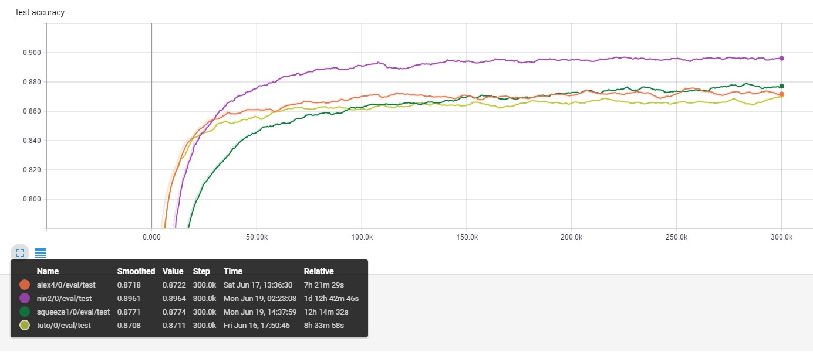

# Explore Tensorflow features with the CIFAR10 dataset

Taking the Tensorflow image tutorial as an inspiration, I developed a
generic model training framework for the CIFAR10 dataset.

As a first step, I took the same model as the tutorial, but without all
training bells and whistles.

I tried different training parameters, and finally decided to keep the ones
provided by the tutorial:
- learning rate = 0.1,
- batch size = 128.

The two main differences are the weight decay, that I deduce from each weight
matrix size, and the weights initialization: I used xavier init.

With that parameters, I achieved results a bit lower than the tutorial (for
exactly the same model):
    75,3 % accuracy after 10,000 iterations instead of 81,3%.

Then, I added data augmentation, that smoothed a lot the training process:
- drastic reduction of the overfitting,
- lower results for early iterations,
- much higher results after 5000+ iterations.

With data augmentation, the accuracy after 10,000 iterations reached 78,8%.

Finally, I used trainable variables moving averages instead of raw values, and
it gave me the extra missing accuracy to match the tutorial performance: 81,4%.

After 300,000 iterations, the model with data augmentation even reached 87%
accuracy.

Tutorial model metrics:

Without data augmentation (32x32x3 images):

Size  : 1.76 Millions of parameters
Flops : 66.98 Millions of operations

With data augmentation (24x24x3 images):

Size     : 1.07 Millions of parameters
Flops    : 37.75 Millions of operations

## Performance experiments

The plan was to experiment further with different models:
- ALexNet-style models that combine convolutional and dense layers,
- NiN networks that remove dense layers altogether,
- SqueezeNets that parallelize convnets,
- Inception nets (yet to be tested).

The idea was to stay within the same range in terms of computational cost and
model size, but trying to find a better compromise between model accuracy and
inference performance.

The figure below provides accuracy for the three best models I obtained,
compared to the tutorial version.

For each model, I evaluated the model size in number of parameters, and its
computational cost in number of operations.

To put these theoretical counters in perspective, I also got 'real' numbers by
checking:
- the actual disk size of the saved models,
- the inference time using the C++ label_image tool (I added some traces)

The ratio between the number of parameters and the actual size on disk seems
consistent for all models, but the inference time is not, and may vary greatly
depending on the actual local optimizations. The winner is however the model
with the less number of operations.

Here are the detailed numbers for all trained models :

### Tuto

Accuracy : 87,2%
Size     : 1.07 Millions of parameters  / 4,278,750 bytes
Flops    : 37.75 Millions of operations / 44 ms

### Alex (alex4)

Accuracy : 87,5%
Size     : 1.49 Millions of parameters  / 5,979,938 bytes
Flops    : 35.20 Millions of operations / 50 ms

### NiN (nin2)

Accuracy : 89,8%
Size     : 0.97 Millions of parameters   / 3,881,548 bytes
Flops    : 251.36 Millions of operations / 90 ms

### SqueezeNet (squeeze1)

Accuracy : 87,8%
Size     : 0.15 Millions of parameters   / 602,892 bytes
Flops    : 22.84 Millions of operations  / 27 ms

## Conclusion

From all model topologies I studied here, the SqueezeNet architecture is by far
the most efficient, reaching the same level of accuracy with a model that is
more than six times lighter than the tutorial version, and more than 1,5x
faster.

## Further experiments

Examine how these models can be compressed using:
- iterative pruning,
- quantization.
